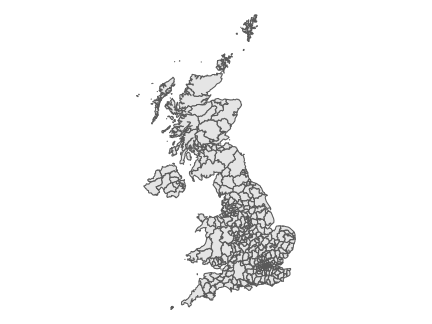
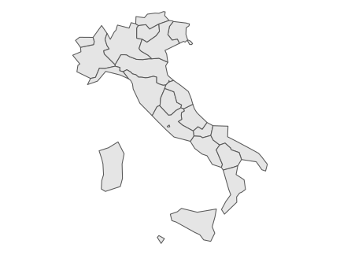
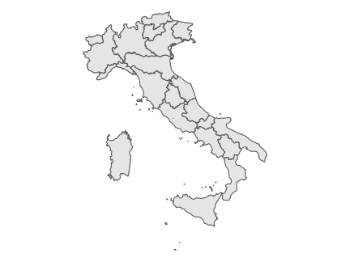
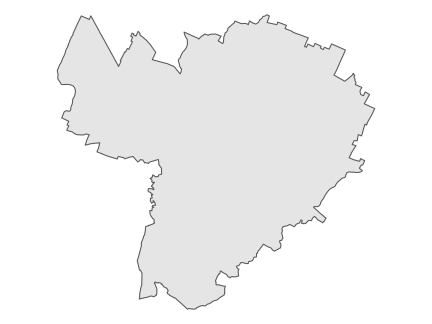
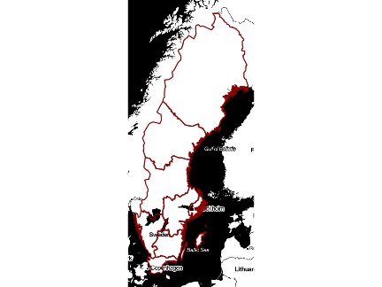
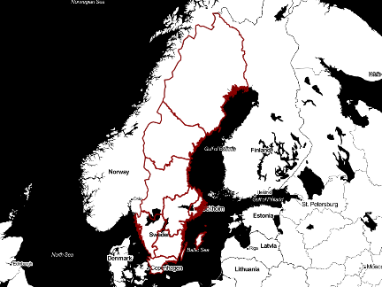
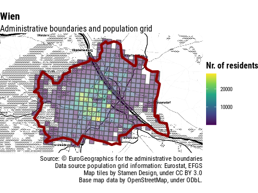

# Removing the boring parts from geocomputation with European data

There are a number of small things that unneccesarily complicate using
geographic data in Europe. The fact that even mapping data released by
Eurostat [are not distributed with a license that allows for their
re-distribution](https://ec.europa.eu/eurostat/web/gisco/geodata/reference-data/administrative-units-statistical-units),
makes it more difficult to liberally pre-process and distribute such
data as is common for example in the United States where they are
usually released in the public domain.[¹](#fn1) But beyond the
licensing, there are still a number of small operations to do - find the
data, download, uncompress, import in a useful format - and they all
take time, and are boring, and demotivating.

So instead of spending time trying to make a map that is nice and
useful, users (I have in mind data journalists, but this may relate to
other users as well) waste a lot of time getting the data into R. They
also end up having multiple copies of similar datasets, and end up
sharing code that is not reproducible. How does it happen?

Let’s say I make a visualisation of electoral data. I use a geographic
dataset on municipalities, and store it somewhere in my working folder.
If I share the code, I often do not share also the geographic dataset
due to size or licensing issues… I can then make a textual reference, or
include a lot of boilerplate code that downloads the data if they are
not locally available, uncompress, import, process them, etc. Even if I
do all of the above, when the following week I will make another map for
an article on climate change, I will end up redownloading the dataset,
etc., ending up with multiple copies of the same geographic dataset. If
I keep my folders synced, this also implies a lot of unnecessary files
stored in the cloud, slowing the sync of the few lines of code that I’d
actually like to be synced.

The package `latlon2map` deals with all of the above, easing the pain of
the R user doing geocomputation. The package addresses the needs of data
journalists and data enthusiasts, will be of particular use to
non-experienced R programmers, but will likely be useful to users with
all levels of experience. Please bear in mind that the package is
functional, but is at an early stage of development, and is targeted
mainly at Europe-based users.

## Getting the data

The core idea of `latlon2map` is to make the process of caching
geographic datasets as frictionless but also as transparent as possible.

The first thing to do is to set a folder where all data will be cached.
This should normally by a folder that you do not sync, e.g. 

``` r
library("ggplot2", quietly = TRUE)
library("dplyr", quietly = TRUE)
library("sf", quietly = TRUE)

library("latlon2map")
ll_set_folder(path = "~/R")
#> [1] "~/R"
```

All functions to get maps start with `ll_get_` to facilitate
auto-completion, and all of them output `sf` objects with crs 4326. As
such, they can be directly used in graphs, without even the need to
store them as separate objects.

If I want a map with local administrative units in the UK, for example,
I can run the following code.

``` r
ggplot()+
  geom_sf(data = ll_get_lau_eu() %>%
            filter(CNTR_CODE == "UK"))
#> ℹ © EuroGeographics for the administrative boundaries
```



plot of chunk uk_lau

The first time that this is run it will download data from Eurostat’s
website, unzip it, import as an `sf` object, and store it locally for
quick retrieval. This means that if you run the same piece of code a
second time, it will print the map almost instantly.

Here is for example the code for having NUTS2 regions in Italy.

``` r
ggplot()+
  geom_sf(data = ll_get_nuts_eu(level = 2) %>%
            filter(CNTR_CODE == "IT"))
#> ℹ © EuroGeographics for the administrative boundaries
#> ℹ Source: https://ec.europa.eu/eurostat/web/gisco/geodata/reference-data/administrative-units-statistical-units/countries
```



plot of chunk it_nuts2_lr

Or with higher resolution:

``` r
ggplot()+
  geom_sf(data = ll_get_nuts_eu(level = 2, resolution = 1) %>%
            filter(CNTR_CODE == "IT"))
#> ℹ © EuroGeographics for the administrative boundaries
#> ℹ Source: https://ec.europa.eu/eurostat/web/gisco/geodata/reference-data/administrative-units-statistical-units/countries
```



plot of chunk it_nuts2_hr

Check all the available options looking at the help files,
e.g. [`?ll_get_nuts_eu`](https://giocomai.github.io/latlon2map/reference/ll_get_nuts_eu.md).

The package may include data from other statistical services; currently,
it integrates geographic data published by Istat in Italy to have higher
detail.

This for example shows the boundary of the city of Bologna, in Italy.
The data for the specific geographic unit are also cached separately, so
a second run of this code will give the result almost immediately (to
clarify: if will not open the full dataset and filter for Bologna, but
will open a pre-cached file with only the data for Bologna to increase
speed and reduce memory requirements).

``` r
ggplot()+
  geom_sf(data = ll_get_nuts_it(name = "Bologna",
                                level = "lau",
                                resolution = "high"))
#> ℹ Source: https://www.istat.it/it/archivio/222527
#> ℹ Istat (CC-BY)
```



plot of chunk bologna_lau_hr

What is important is that this code can easily be shared and will work
even if the geographics datasets are not previously present on the
computer where the same code will be run. Even if you have many
different projects using this data, only one copy will need to be stored
on a given workstation.

Information on copyright is displayed on the console at each call of the
function unless `silent = TRUE` is enabled.

The original shapefiles and the accompanying documentation remains
stored under the folder `ll_data`.

## Getting the right proportions

Another small nuisance is related to including in the same post maps or
areas with different proportions.

For example, Portugal and the Netherlands have different shapes, but I’d
like to have all maps in my my post with the same height/width ratio.
This is slightly complicated by the fact that scales are in degrees, so
it take some effort to get get them right. The function `ll_bbox` takes
care of this, so that instead of some maps that are very wide, and some
that are very tall, e.g. 

``` r
remotes::install_github("paleolimbot/ggspatial", upgrade = "never", quiet = TRUE)
library("ggspatial")

sf_reference <- ll_get_nuts_eu(level = 2, resolution = 1) %>% filter(CNTR_CODE == "SE")

ggplot() +
    annotation_map_tile(type = "stamenbw",
                        zoomin = 0,
                        cachedir = fs::path(ll_set_folder(), "ll_data")) +
  geom_sf(data = sf_reference, colour = "darkred", fill = NA)
```



plot of chunk sweden_bw_thin

…we can have this all of them with the same proportion.

``` r
ggplot() +
    annotation_map_tile(type = "stamenbw", zoomin = 0, cachedir = fs::path(ll_set_folder(), "ll_data")) +
    geom_sf(data = sf::st_as_sfc(ll_bbox(sf = sf_reference,ratio = "4:3")), fill = NA, color = NA) +
  geom_sf(data = sf_reference, colour = "darkred", fill = NA)
#> Zoom: 5
#> Warning in showSRID(uprojargs, format = "PROJ", multiline = "NO", prefer_proj = prefer_proj): Discarded
#> ellps WGS 84 in CRS definition: +proj=merc +a=6378137 +b=6378137 +lat_ts=0 +lon_0=0 +x_0=0 +y_0=0 +k=1
#> +units=m +nadgrids=@null +wktext +no_defs
#> Warning in showSRID(uprojargs, format = "PROJ", multiline = "NO", prefer_proj = prefer_proj): Discarded
#> datum WGS_1984 in CRS definition
#> Warning in showSRID(uprojargs, format = "PROJ", multiline = "NO", prefer_proj = prefer_proj): Discarded
#> ellps WGS 84 in CRS definition: +proj=merc +a=6378137 +b=6378137 +lat_ts=0 +lon_0=0 +x_0=0 +y_0=0 +k=1
#> +units=m +nadgrids=@null +wktext +no_defs
#> Warning in showSRID(uprojargs, format = "PROJ", multiline = "NO", prefer_proj = prefer_proj): Discarded
#> datum WGS_1984 in CRS definition
```



plot of chunk sweden_be_4_3

## Get the population grid

There are more complex geographic data than simple boundary lines.
Eurostat for example published a population grid, pointing at how many
people lives in each square km of the continent. Such data can be useful
for a number of analyses, but they tend to come in big files. Again,
`lonlat2map` caches the result, including pre-processed data if a
consistent name is provided.

\[the following code chunks are not evaluated for facilitating
auto-deploy of the website with vignette\]

``` r
name <- "Wien"

sf_location <- ll_get_lau_eu(name = name)
  
desired_bbox <- st_as_sfc(ll_bbox(sf = sf_location, ratio = "16:9"))
  
lau_grid_name <- stringr::str_c(name, "_lau_high-st_intersects")
    
sf_location_grid <- ll_get_population_grid(match_sf = sf_location,
                                           match_name = lau_grid_name,
                                           match_country = "AT",
                                           join = sf::st_intersects,
                                           silent = TRUE) %>%
  dplyr::rename(`Nr. of residents` = TOT_P)

ggplot() +
    annotation_map_tile(type = "stamenbw", zoomin = 0, cachedir = fs::path(ll_set_folder(), "ll_data")) +
    geom_sf(data = desired_bbox, fill = NA, color = NA) +
    geom_sf(data = sf_location_grid,
            mapping = aes(fill = `Nr. of residents`), alpha = 0.5) +
  scale_fill_viridis_c() +
    geom_sf(data = sf_location,
            colour = "darkred",
            size = 2,
            fill = NA,
            alpha = 0.8) +
      labs(title = paste(sf_location$LAU_LABEL), 
       subtitle = "Administrative boundaries and population grid",
       caption = "Source: © EuroGeographics for the administrative boundaries
       Data source population grid information: Eurostat, EFGS
       Map tiles by Stamen Design, under CC BY 3.0
       Base map data by OpenStreetMap, under ODbL.")
```



plot of chunk viewnna_pop_grid

## Population-weighted centre

`lonlat2map` includes some convenience functions to deal with normally
tedious processes, e.g. finding the population-weighted center of an
area.

``` r
name = "Palmanova"
sf_location <- ll_get_nuts_it(name = name, level = "lau", resolution = "high", silent = TRUE)

centroid <- sf::st_centroid(sf_location %>%
                              sf::st_transform(crs = 3857)) %>%
  sf::st_transform(crs = 4326)
#> Warning in st_centroid.sf(sf_location %>% sf::st_transform(crs = 3857)): st_centroid assumes attributes
#> are constant over geometries of x

desired_bbox <- st_as_sfc(ll_bbox(sf = sf_location, ratio = "4:3"))

lau_grid_name_temp <- stringr::str_c(name, "_lau_high-st_intersects")

sf_location_grid <- ll_get_population_grid(match_sf = sf_location,
                                           match_name = lau_grid_name_temp,
                                           match_country = "IT",
                                           join = sf::st_intersects,
                                           silent = TRUE)

pop_centroid <- ll_find_pop_centre(sf_location = sf_location,
                                   sf_population_grid = sf_location_grid,
                                   power = 2)
#> Warning in st_centroid.sf(.): st_centroid assumes attributes are constant over geometries of x

ggplot() +
    annotation_map_tile(type = "stamenbw", zoomin = 0, cachedir = fs::path(ll_set_folder(), "ll_data")) +
    geom_sf(data = desired_bbox, fill = NA, color = NA) +
    geom_sf(data = sf_location_grid %>% rename(`Nr. of residents` = TOT_P),
            mapping = aes(fill = `Nr. of residents`), alpha = 0.5) +
  scale_fill_viridis_c() +
    geom_sf(data = sf_location,
            colour = "darkred",
            size = 2,
            fill = NA,
            alpha = 0.8) +
    geom_sf(data = centroid,
          colour = "darkred",
          fill = "coral",
          size = 5,
          shape = 21,
          alpha = 0.8) +
  geom_sf(data = pop_centroid,
          colour = "blue4",
          fill = "cornflowerblue",
          size = 5,
          shape = 21,
          alpha = 0.8) +
      labs(title = paste(sf_location$COMUNE), 
       subtitle = "Administrative boundaries and population grid
Centroid in red, population-weighted centre in blue",
       caption = "Source: © EuroGeographics for the administrative boundaries
       Data source population grid information: Eurostat, EFGS
       Map tiles by Stamen Design, under CC BY 3.0
       Base map data by OpenStreetMap, under ODbL.")
#> Zoom: 14
#> Warning in showSRID(uprojargs, format = "PROJ", multiline = "NO", prefer_proj = prefer_proj): Discarded
#> ellps WGS 84 in CRS definition: +proj=merc +a=6378137 +b=6378137 +lat_ts=0 +lon_0=0 +x_0=0 +y_0=0 +k=1
#> +units=m +nadgrids=@null +wktext +no_defs
#> Warning in showSRID(uprojargs, format = "PROJ", multiline = "NO", prefer_proj = prefer_proj): Discarded
#> datum WGS_1984 in CRS definition
#> Warning in showSRID(uprojargs, format = "PROJ", multiline = "NO", prefer_proj = prefer_proj): Discarded
#> ellps WGS 84 in CRS definition: +proj=merc +a=6378137 +b=6378137 +lat_ts=0 +lon_0=0 +x_0=0 +y_0=0 +k=1
#> +units=m +nadgrids=@null +wktext +no_defs
#> Warning in showSRID(uprojargs, format = "PROJ", multiline = "NO", prefer_proj = prefer_proj): Discarded
#> datum WGS_1984 in CRS definition
```


plot of chunk pop_weighted_centre_palmanova

The function is flexible, and can be used with more granular population
data such as those [distributed by
Facebook](https://dataforgood.fb.com/docs/methodology-high-resolution-population-density-maps-demographic-estimates/),
which can be loaded with the function
[`ll_get_population_grid_hr()`](https://giocomai.github.io/latlon2map/reference/ll_get_population_grid_hr.md).

``` r
lau_grid_name_temp <- stringr::str_c(name, "_lau_hr-st_intersects")

sf_location_grid_hr <- ll_get_population_grid_hr(geo = "IT", 
                          match_sf = sf_location,
                          match_name = lau_grid_name_temp,
                          join = sf::st_intersects,
                          silent = TRUE)

pop_centroid_hr <- ll_find_pop_centre(sf_location = sf_location,
                                       sf_population_grid = sf_location_grid_hr,
                                       power = 5)

ggplot() +
    annotation_map_tile(type = "stamenbw", zoomin = 0, cachedir = fs::path(ll_set_folder(), "ll_data")) +
    geom_sf(data = desired_bbox, fill = NA, color = NA) +
    geom_sf(data = sf_location_grid_hr %>% rename(`Nr. of residents` = Population),
            mapping = aes(colour = `Nr. of residents`), alpha = 0.5) +
  scale_colour_viridis_c() +
    geom_sf(data = sf_location,
            colour = "darkred",
            size = 2,
            fill = NA,
            alpha = 0.8) +
    geom_sf(data = centroid,
          colour = "darkred",
          fill = "coral",
          size = 5,
          shape = 21,
          alpha = 0.8) +
  geom_sf(data = pop_centroid_hr,
          colour = "blue4",
          fill = "cornflowerblue",
          size = 5,
          shape = 21,
          alpha = 0.8) +
      labs(title = paste(sf_location$COMUNE), 
       subtitle = "Administrative boundaries and population grid
Centroid in red, population-weighted centre in blue",
       caption = "Source: © EuroGeographics for the administrative boundaries
       Facebook High Resolution Population Density Maps (CC-BY)
       Map tiles by Stamen Design, under CC BY 3.0
       Base map data by OpenStreetMap, under ODbL.")
```


plot of chunk pop_weighted_centre_palmanova_hr

## More to come

This package was started while writing [a blog
post](https://codebase.giorgiocomai.eu/2020/03/25/population-weighted-centre/),
and not everything may work smoothly at this stage. Feel free to get in
touch with the author or [file an issue on
GitHub](https://github.com/giocomai/latlon2map).

Future versions of `lonlat2map` will have integrated support for more
data sources, as well as additional functions to facilitate common use
cases.

------------------------------------------------------------------------

1.  The licensing is particularly problematic since it does not allow to
    use the data “for commercial purposes”: does this mean that data
    journalists can or cannot use these data? If somebody in relevant EU
    institutions reads this, I beg you, please, please, release
    geographic data in the public domain.
